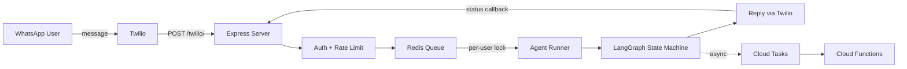
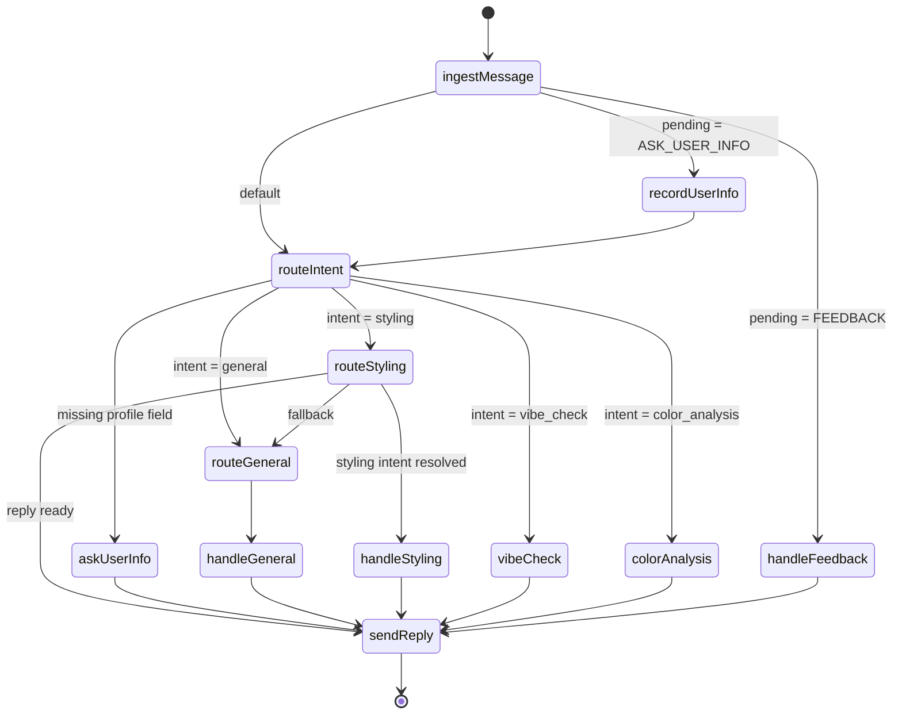
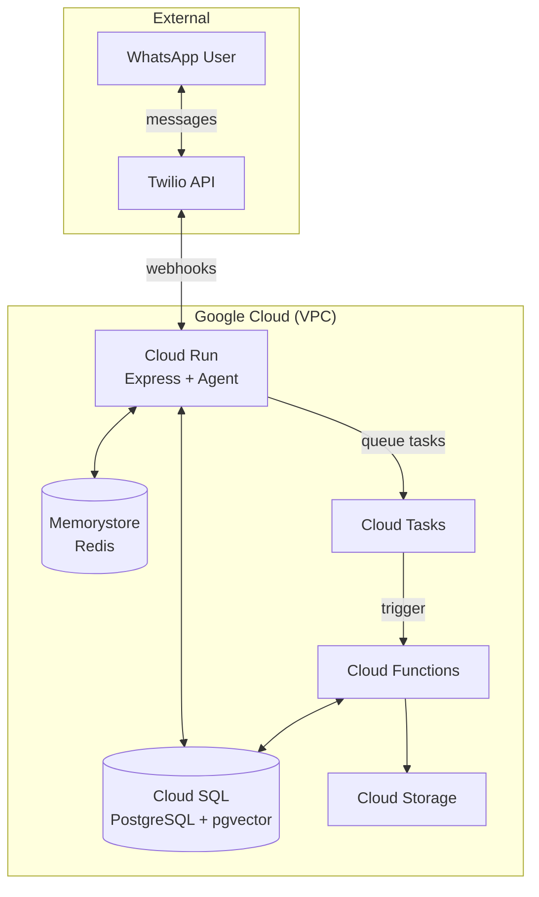
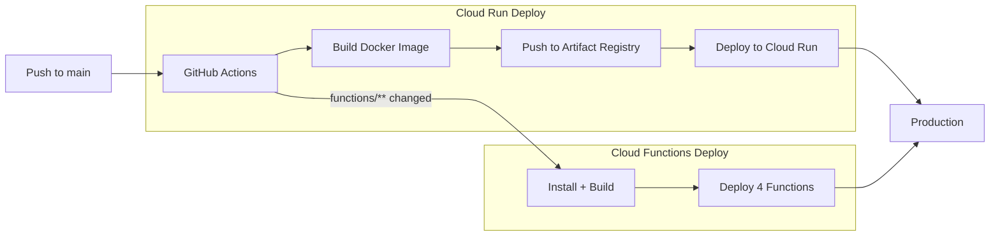

# Broadway Copilot

A production WhatsApp AI stylist I built during my internship at Broadway. It's a conversational agent that gives personalized fashion advice: outfit analysis, color matching, vibe checks, and wardrobe recommendations. Users send outfit photos for vibe checks, get personalized color analysis, build a searchable wardrobe catalog, and receive styling recommendations, all through natural conversation.

Currently live with 250 internal users. Rollout to Broadway's 50k customer base is planned.

## At a Glance

| Aspect | Detail |
|:-------|:-------|
| **Channel** | WhatsApp via Twilio webhooks and status callbacks |
| **Runtime** | Node.js 22, Express 5, Docker Compose locally, Cloud Run Gen 2 in production |
| **Agent** | Custom LangGraph state machine with 13 nodes, conditional edges, and abort-safe execution |
| **Storage** | PostgreSQL 17 with pgvector for conversations and wardrobe. Redis 8 for queues and rate limiting |
| **LLMs** | OpenAI (vision, embeddings, structured output) and Groq (fast conversational chat) |
| **Infrastructure** | Cloud Run, Cloud SQL, Cloud Memorystore, Cloud Tasks, Cloud Functions, VPC networking |

## Architecture and Request Lifecycle


```mermaid
graph LR
    A[WhatsApp User] -->|message| B[Twilio]
    B -->|POST /twilio/| C[Express Server]
    C --> D[Auth + Rate Limit]
    D --> E[Redis Queue]
    E -->|per-user lock| F[Agent Runner]
    F --> G[LangGraph State Machine]
    G --> H[Reply via Twilio]
    H -->|status callback| C
    G -.->|async| I[Cloud Tasks]
    I --> J[Cloud Functions]
```

1. **Inbound Webhook.** Validates Twilio signatures, applies rate limiting and whitelist checks, deduplicates message SIDs, and enqueues work per user.
2. **Concurrency Control.** Redis-backed locks ensure only one message per user is processed at a time. New messages abort the currently running agent via `user_abort:<WaId>` pub/sub.
3. **Agent Execution.** Loads user and conversation context, seeds a `GraphRun` record, then executes the LangGraph state machine.
4. **Node Processing.** Specialized nodes handle intent routing, profile inference, outfit analysis, and response crafting. Nodes may call LLMs, analyze images, or query the database.
5. **Reply Delivery.** The `sendReply` node sends text, menu, or image messages via Twilio. Delivery confirmation subscribes to status callbacks via Redis channels.
6. **Tracing and Persistence.** Message transcripts, node runs, and LLM interactions are persisted in Postgres (`GraphRun`, `NodeRun`, `LLMTrace`) for replay and debugging.

## Agent Graph


```mermaid
stateDiagram-v2
    [*] --> ingestMessage

    ingestMessage --> recordUserInfo : pending = ASK_USER_INFO
    ingestMessage --> handleFeedback : pending = FEEDBACK
    ingestMessage --> routeIntent : default

    recordUserInfo --> routeIntent

    routeIntent --> askUserInfo : missing profile field
    routeIntent --> routeGeneral : intent = general
    routeIntent --> vibeCheck : intent = vibe_check
    routeIntent --> colorAnalysis : intent = color_analysis
    routeIntent --> routeStyling : intent = styling

    routeGeneral --> handleGeneral
    routeStyling --> handleStyling : styling intent resolved
    routeStyling --> routeGeneral : fallback
    routeStyling --> sendReply : reply ready

    askUserInfo --> sendReply
    handleGeneral --> sendReply
    handleStyling --> sendReply
    vibeCheck --> sendReply
    colorAnalysis --> sendReply
    handleFeedback --> sendReply

    sendReply --> [*]
```

The graph definition lives in `src/agent/graph.ts`. It wires 13 nodes with conditional edges for branching conversations.

**What each node does:**
- `ingestMessage` normalizes the webhook payload and stores the inbound message
- `recordUserInfo` captures user-provided profile slots (gender, style preferences)
- `routeIntent` uses an LLM to classify intent into general, styling, vibe check, or color analysis flows
- `vibeCheck` and `colorAnalysis` run LLM + vision prompts on user photos and store structured outputs validated with Zod schemas
- `handleStyling` handles occasion, vacation, pairing, and suggestion sub-flows with pgvector wardrobe search and memory retrieval
- `sendReply` selects response modality (text, menu, image) and enqueues background tasks (wardrobe indexing, memory extraction)

Custom LangChain-style tools in `src/agent/tools.ts` provide hybrid wardrobe search (semantic + keyword + text), color analysis retrieval, and memory lookup via pgvector embeddings.

## Infrastructure and Service Topology


```mermaid
graph TB
    subgraph External
        User[WhatsApp User]
        Twilio[Twilio API]
    end

    subgraph "Google Cloud (VPC)"
        CR[Cloud Run<br/>Express + Agent]
        SQL[(Cloud SQL<br/>PostgreSQL + pgvector)]
        Redis[(Memorystore<br/>Redis)]
        CT[Cloud Tasks]
        CF[Cloud Functions]
        GCS[Cloud Storage]
    end

    User <-->|messages| Twilio
    Twilio <-->|webhooks| CR
    CR <--> SQL
    CR <--> Redis
    CR -->|queue tasks| CT
    CT -->|trigger| CF
    CF <--> SQL
    CF --> GCS
```

| Component | Responsibility |
|:----------|:---------------|
| `src/index.ts` | Express app bootstrap, Twilio webhook routing, per-user message queue with Redis concurrency control |
| `src/agent/` | LangGraph state machine definition, 12 node implementations, agent tools, execution tracing |
| `src/lib/graph.ts` | Custom lightweight StateGraph implementation (~200 lines) with abort signal support |
| `src/lib/ai/` | Provider-agnostic LLM abstraction layer: base chat models, structured output runnables, tool execution, cost tracking |
| `src/lib/twilio.ts` | Twilio REST helpers with delivery status tracking via Redis pub/sub |
| `src/middleware/` | Twilio signature validation, Redis-backed token bucket rate limiter, user whitelist |
| `functions/` | 4 Cloud Functions for background work: wardrobe indexing, memory extraction, image upload, feedback requests |

## Data and Persistence

Prisma manages the relational schema (source of truth in `functions/prisma/schema.prisma`). Key models:

- **User** stores WhatsApp contact metadata and inferred profile attributes (gender, age group, style preferences)
- **Conversation** groups messages into sessions, rotated after a configurable inactivity timeout
- **Message** tracks inbound/outbound messages with role, classified intent, button payload, and pending action state
- **Media** holds metadata and storage pointers (Twilio URL, server URL, GCS URI) for user-uploaded images
- **VibeCheck / ColorAnalysis** are structured LLM analysis outputs with confidence scores, stored per-message
- **WardrobeItem** is a catalog entry with category, type, colors, attributes, search document, keyword array, and pgvector embeddings
- **Memory** stores long-term user facts with semantic embeddings for retrieval-augmented generation
- **GraphRun / NodeRun / LLMTrace** are execution tracing artifacts: per-run status, per-node duration, per-LLM-call model/tokens/cost/request/response

Run `npx prisma studio` inside the container to inspect data during development.

## Key Engineering Decisions

**Custom graph engine instead of LangChain/LangGraph.** The official libraries pulled in too many dependencies and abstractions for what I needed. I wrote a lightweight `StateGraph` class (~200 lines) that handles nodes, conditional edges, and compilation. It's TypeScript-native, easier to debug, and gives full control over execution with abort signal support and per-node tracing.

**Dual-LLM routing (OpenAI + Groq).** OpenAI handles vision tasks (outfit photos, color analysis) since Groq doesn't support image inputs. Groq handles text-only tasks because it's significantly faster and cheaper. The routing happens at the node level, not per-request.

**pgvector for wardrobe search.** Users upload photos of their clothes. Each item gets embedded and stored in Postgres with pgvector. When giving outfit recommendations, the agent queries by vector similarity to find relevant pieces from the user's actual wardrobe. The search is hybrid: semantic similarity, keyword matching, and full-text search combined.

**Redis for concurrency control.** Each user gets a processing lock so only one message runs through the agent at a time. If a new message arrives mid-run, it publishes an abort signal via Redis pub/sub, cancels the current run, and starts fresh. This prevents race conditions and stale responses.

**Trace-first observability.** Every graph run records node executions, LLM requests/responses, token counts, and costs to Postgres (`GraphRun` / `NodeRun` / `LLMTrace`). This means full replay debugging without relying on ephemeral log streams. See [TRACING.md](TRACING.md) for the tracing architecture.

**Cloud Tasks for async work.** Wardrobe indexing, memory extraction, image uploads, and feedback requests are offloaded to Cloud Functions via Cloud Tasks to keep the webhook response path fast. In development mode, these short-circuit and run inline. Each task writes lifecycle events (queued, in-progress, completed, failed) to the `Task` table for idempotent execution.

**Strict TypeScript from day one.** `tsconfig.json` enables `strict`, `noUncheckedIndexedAccess`, `exactOptionalPropertyTypes`, `noImplicitAny`, and `useUnknownInCatchVariables`. There's only 1 justified `any` in the entire codebase (a runtime type guard in Cloud Functions).

## Production Infrastructure

- **Application Runtime:** Cloud Run Gen 2 service with 2 vCPUs, 4 Gi RAM, concurrency of 8, and `min-instances=1` to keep the agent warm.
- **Private Networking:** Deployments attach to a VPC network and subnet, restricting egress to private ranges so outbound calls to Cloud SQL, Memorystore, and internal APIs stay on private IP space.
- **Data Plane:** Regional Cloud SQL for PostgreSQL (pgvector enabled) stores conversations, traces, and wardrobe data. Cloud Memorystore (Redis) provides queues, locks, and abort channels. Both are reached through the VPC connector.
- **Async Workers:** Google Cloud Tasks triggers background Cloud Functions for image uploads, memory extraction, wardrobe indexing, and post-conversation feedback. Each task writes lifecycle events to the `Task` table for idempotent retry.
- **Media and Assets:** User-uploaded images are persisted to Cloud Storage buckets in production while mirrored to `uploads/` locally.
- **Secrets and Config:** Runtime secrets come from Secret Manager via Workload Identity Federation. Feature flags are injected as Cloud Run environment variables.

## CI/CD Pipeline


```mermaid
graph LR
    A[Push to main] --> B[GitHub Actions]

    subgraph "Cloud Run Deploy"
        B --> C[Build Docker Image]
        C --> D[Push to Artifact Registry]
        D --> E[Deploy to Cloud Run]
    end

    subgraph "Cloud Functions Deploy"
        B -->|functions/** changed| F[Install + Build]
        F --> G[Deploy 4 Functions]
    end

    E --> H[Production]
    G --> H
```

- **Cloud Run Deploy:** On every push to `main`, GitHub Actions authenticates with Workload Identity Federation, builds the container, publishes to Artifact Registry, and deploys to Cloud Run with VPC, secret, and scaling configuration.
- **Cloud Functions Deploy:** Triggered for changes under `functions/**`, this workflow builds TypeScript and redeploys the task handlers (`imageUpload`, `storeMemories`, `indexWardrobe`, `sendFeedbackRequest`) with secrets from Secret Manager.
- **Automated Releases:** Merges to `main` redeploy both the chat service and any updated Cloud Functions. Approved pull requests roll out to production without manual steps.

## Running Locally

### With Docker (recommended)

```bash
cp .env.example .env   # fill in Twilio + LLM API keys
docker compose up --build
```

Compose starts four services:

- **app** : Node.js dev container (installs deps, runs Prisma migrations, launches `npm run dev`)
- **db** : PostgreSQL 17 with the pgvector extension
- **redis** : Redis 8 for queues, locks, and rate limiting
- **ngrok** : Exposes the Express server and prints the public HTTPS URL

Watch the `app` logs for `Ngrok tunnel ready` and note the printed URL. Shut the stack down with `docker compose down` (add `-v` to reset Postgres and Redis volumes).

### Without Docker

1. Install dependencies with `npm ci`
2. Provide Postgres and Redis instances (local or remote) and set `DATABASE_URL` / `REDIS_URL` accordingly
3. Run migrations: `npx prisma migrate deploy` or `npx prisma db push` for dev sync
4. Start the server with `npm run dev`

You'll still need ngrok (or another reverse proxy) to expose your local server to Twilio. Cloud Run handles this automatically in production.

### Twilio Setup

1. In the [Twilio Console](https://www.twilio.com/console), enable the WhatsApp sandbox or request a production sender
2. Set the **Webhook URL** to `https://<ngrok-domain>/twilio/` with method `POST`
3. Set the **Status Callback URL** to `https://<ngrok-domain>/twilio/callback/` with method `POST`
4. Send a WhatsApp message to your Twilio number. Requests will now reach the local agent.

See `.env.example` for all configuration options.

### Common Commands

| Command | Purpose |
|:--------|:--------|
| `npm run dev` | Start the Express server with hot reload |
| `npm run build` | Compile TypeScript to `dist/` |
| `npm run lint` | Lint the codebase |
| `npm test` | Run all tests (Vitest) |
| `npm run typecheck` | TypeScript type checking |
| `npm run format` | Prettier formatting |
| `npx prisma generate` | Regenerate Prisma client after schema updates |
| `npx prisma migrate dev` | Create and apply a new migration locally |
| `npm run graph` | Regenerate `langgraph.png` from the current state graph |

## Repository Layout

```
broadway-copilot/
├── src/                                # Express API + agent core
│   ├── agent/                          # LangGraph state machine
│   │   ├── graph.ts                    # Graph definition: 13 nodes, conditional edges
│   │   ├── state.ts                    # GraphState type with discriminated unions
│   │   ├── tools.ts                    # Agent tools (wardrobe search, memory, color analysis)
│   │   ├── tracing.ts                  # Execution tracing infrastructure
│   │   ├── index.ts                    # Agent initialization and run entry point
│   │   └── nodes/                      # 12 node implementations
│   │       ├── ingestMessage.ts        # Normalize webhook payload, store message
│   │       ├── routeIntent.ts          # LLM-powered intent classification
│   │       ├── routeGeneral.ts         # General intent sub-routing
│   │       ├── routeStyling.ts         # Styling intent sub-routing
│   │       ├── recordUserInfo.ts       # Capture user profile slots
│   │       ├── askUserInfo.ts          # Request missing profile fields
│   │       ├── handleGeneral.ts        # Greeting, menu, and chat responses
│   │       ├── handleStyling.ts        # Outfit pairing, occasion, and suggestions
│   │       ├── handleFeedback.ts       # Post-conversation feedback handling
│   │       ├── vibeCheck.ts            # Vision-powered outfit analysis
│   │       ├── colorAnalysis.ts        # Personal color analysis from photos
│   │       └── sendReply.ts            # Response delivery via Twilio
│   ├── lib/                            # Core libraries
│   │   ├── graph.ts                    # Custom StateGraph implementation (~200 lines)
│   │   ├── prisma.ts                   # Prisma client singleton
│   │   ├── redis.ts                    # Redis client singleton
│   │   ├── twilio.ts                   # Twilio messaging + delivery tracking
│   │   ├── tasks.ts                    # Cloud Tasks integration
│   │   └── ai/                         # LLM abstraction layer
│   │       ├── core/                   # Base models, messages, tools, runnables
│   │       ├── openai/                 # OpenAI chat models + embeddings
│   │       ├── groq/                   # Groq chat model implementation
│   │       ├── agents/                 # Agent executor with tool loop
│   │       └── config/                 # Provider config + cost tracking
│   ├── middleware/                      # Express middleware
│   │   ├── auth.ts                     # Twilio signature validation
│   │   ├── rateLimiter.ts              # Redis-backed token bucket rate limiter
│   │   ├── whitelist.ts                # User whitelist checks
│   │   └── errors.ts                   # Centralized error handler
│   ├── utils/                          # Shared utilities
│   │   ├── logger.ts                   # Pino-based structured logging
│   │   ├── context.ts                  # User/conversation context resolution
│   │   ├── errors.ts                   # HTTP error classes + normalization
│   │   ├── prompts.ts                  # Prompt template loader
│   │   ├── media.ts                    # Media download and processing
│   │   ├── text.ts                     # Text extraction utilities
│   │   ├── constants.ts                # Application constants and TTLs
│   │   └── paths.ts                    # File path utilities
│   └── index.ts                        # HTTP entrypoint and message queue bootstrap
├── functions/                          # Google Cloud Functions
│   ├── src/
│   │   ├── index.ts                    # Function dispatcher + task lifecycle management
│   │   ├── handlers/
│   │   │   ├── imageUpload.ts          # Upload user images to Cloud Storage
│   │   │   ├── storeMemories.ts        # Extract and store conversation memories
│   │   │   ├── indexWardrobe.ts        # Catalog wardrobe items from photos
│   │   │   └── sendFeedbackRequest.ts  # Send post-conversation feedback prompt
│   │   └── utils/                      # Function-specific utilities
│   └── prisma/
│       └── schema.prisma               # Authoritative Prisma schema
├── prompts/                            # LLM prompt templates
│   ├── core/                           # Persona definition
│   ├── routing/                        # Intent and sub-intent routing
│   ├── handlers/                       # Task-specific prompts (analysis, styling, general)
│   └── data/                           # User info and feedback prompts
├── __tests__/                          # Unit tests (Vitest)
├── .github/workflows/                  # CI/CD (Cloud Run + Cloud Functions deploy)
├── docker-compose.yml                  # Local dev orchestration (4 services)
├── Dockerfile                          # Multi-stage production build
└── TRACING.md                          # Agent tracing architecture deep-dive
```

## Related Projects

- [Broadway Copilot Dashboard](https://github.com/advitrocks9/broadway-copilot-dashboard): Admin dashboard for user management and conversation analytics
