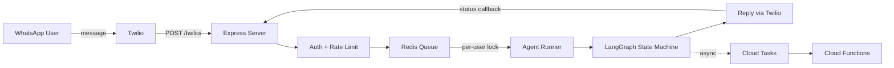
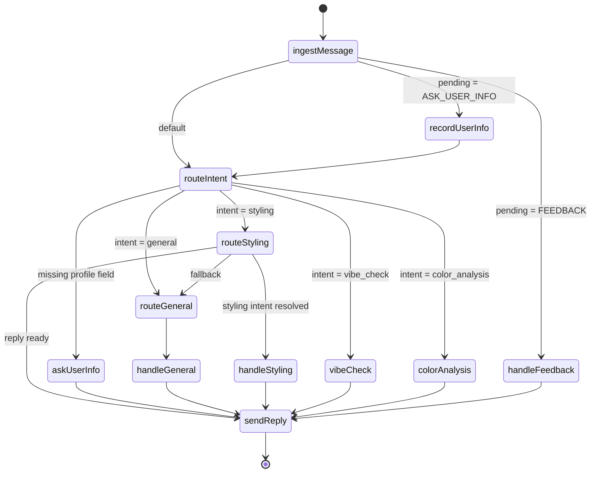
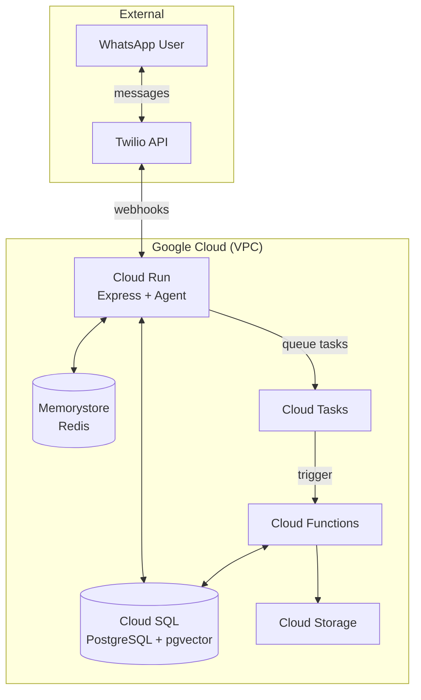
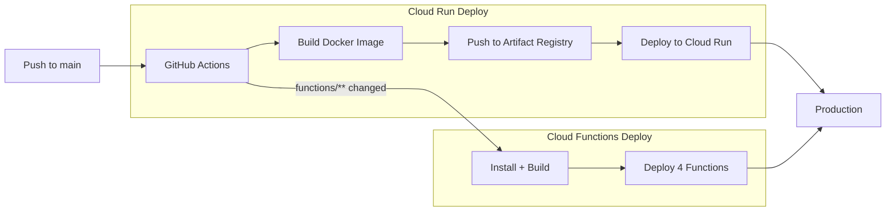

<div align="center">

# Broadway Copilot

*AI-powered personal stylist on WhatsApp*


</div>

---

## Highlights

- **LangGraph conversational agent** -- custom TypeScript state-machine with 13 nodes, conditional branching, and abort-safe execution
- **Vision-powered outfit analysis** -- vibe checks, color analysis, and wardrobe cataloging from user photos via OpenAI vision
- **Production infrastructure** -- Cloud Run Gen 2, Cloud SQL (pgvector), Memorystore, Cloud Tasks, zero-downtime CI/CD
- **Persistent wardrobe and memory** -- pgvector semantic search across wardrobe items and long-term user memories
- **Full observability** -- per-node execution tracing, LLM request/response logging, token and cost tracking to Postgres

---

Broadway Copilot is a production AI stylist that lives on WhatsApp. Users send outfit photos for vibe checks, get personalized color analysis, build a searchable wardrobe catalog, and receive styling recommendations -- all through natural conversation. Under the hood, a custom LangGraph state machine orchestrates 13 specialized nodes, routing each message through intent classification, profile inference, vision analysis, and tool-augmented response generation with full execution tracing.

---

## Table of Contents

- [At a Glance](#at-a-glance)
- [Architecture & Request Lifecycle](#architecture--request-lifecycle)
- [LangGraph Agent Flow](#langgraph-agent-flow)
- [Infrastructure & Service Topology](#infrastructure--service-topology)
- [Data & Persistence](#data--persistence)
- [Key Design Decisions](#key-design-decisions)
- [Production Infrastructure](#production-infrastructure)
- [CI/CD Pipeline](#cicd-pipeline)
- [Repository Layout](#repository-layout)
- [Code Quality & Testing](#code-quality--testing)
- [Related Projects](#related-projects)
- [Contributing](#contributing)

---

## At a Glance

| Aspect | Detail |
|:-------|:-------|
| **Channel** | WhatsApp via Twilio webhooks and status callbacks |
| **Runtime** | Node.js 22, Express 5, Docker Compose locally, Cloud Run Gen 2 in production |
| **Agent** | Custom LangGraph state machine -- 13 nodes, conditional edges, abort-safe execution |
| **Storage** | PostgreSQL 17 with pgvector for conversations and wardrobe; Redis 8 for queues and rate limiting |
| **LLMs** | OpenAI (vision, embeddings, structured output) and Groq (fast conversational chat) |
| **Infrastructure** | Cloud Run, Cloud SQL, Cloud Memorystore, Cloud Tasks, Cloud Functions, VPC networking |

---

## Architecture & Request Lifecycle


```mermaid
graph LR
    A[WhatsApp User] -->|message| B[Twilio]
    B -->|POST /twilio/| C[Express Server]
    C --> D[Auth + Rate Limit]
    D --> E[Redis Queue]
    E -->|per-user lock| F[Agent Runner]
    F --> G[LangGraph State Machine]
    G --> H[Reply via Twilio]
    H -->|status callback| C
    G -.->|async| I[Cloud Tasks]
    I --> J[Cloud Functions]
```

1. **Inbound Webhook** -- Validates Twilio signatures, applies rate limiting and whitelist checks, deduplicates message SIDs, and enqueues work per user.
2. **Concurrency Control** -- Redis-backed locks ensure only one message per user is processed at a time. New messages abort the currently running agent via `user_abort:<WaId>` pub/sub.
3. **Agent Execution** -- Loads user and conversation context, seeds a `GraphRun` record, then executes the LangGraph state machine.
4. **Node Processing** -- Specialized nodes handle intent routing, profile inference, outfit analysis, and response crafting. Nodes may call LLMs, analyze images, or query the database.
5. **Reply Delivery** -- The `sendReply` node sends text, menu, or image messages via Twilio. Delivery confirmation subscribes to status callbacks via Redis channels.
6. **Tracing and Persistence** -- Message transcripts, node runs, and LLM interactions are persisted in Postgres (`GraphRun`, `NodeRun`, `LLMTrace`) for replay and debugging.

---

## LangGraph Agent Flow


```mermaid
stateDiagram-v2
    [*] --> ingestMessage

    ingestMessage --> recordUserInfo : pending = ASK_USER_INFO
    ingestMessage --> handleFeedback : pending = FEEDBACK
    ingestMessage --> routeIntent : default

    recordUserInfo --> routeIntent

    routeIntent --> askUserInfo : missing profile field
    routeIntent --> routeGeneral : intent = general
    routeIntent --> vibeCheck : intent = vibe_check
    routeIntent --> colorAnalysis : intent = color_analysis
    routeIntent --> routeStyling : intent = styling

    routeGeneral --> handleGeneral
    routeStyling --> handleStyling : styling intent resolved
    routeStyling --> routeGeneral : fallback
    routeStyling --> sendReply : reply ready

    askUserInfo --> sendReply
    handleGeneral --> sendReply
    handleStyling --> sendReply
    vibeCheck --> sendReply
    colorAnalysis --> sendReply
    handleFeedback --> sendReply

    sendReply --> [*]
```

**Graph Definition:** `src/agent/graph.ts` wires 13 nodes with conditional edges for complex branching conversations.

**Representative Nodes:**
- `ingestMessage` -- Normalizes the webhook payload and stores the inbound message
- `recordUserInfo` -- Captures user-provided profile slots (gender, style preferences)
- `routeIntent` -- LLM-powered intent classification into general, styling, vibe check, or color analysis flows
- `vibeCheck` / `colorAnalysis` -- Run LLM + vision prompts on user photos and store structured outputs with Zod-validated schemas
- `handleStyling` -- Occasion, vacation, pairing, and suggestion sub-flows with pgvector wardrobe search and memory retrieval
- `sendReply` -- Selects response modality (text, menu, image) and enqueues background tasks (wardrobe indexing, memory extraction)

**Tools:** Custom LangChain-style tools in `src/agent/tools.ts` provide hybrid wardrobe search (semantic + keyword + text), color analysis retrieval, and memory lookup via pgvector embeddings.

---

## Infrastructure & Service Topology


```mermaid
graph TB
    subgraph External
        User[WhatsApp User]
        Twilio[Twilio API]
    end

    subgraph "Google Cloud (VPC)"
        CR[Cloud Run<br/>Express + Agent]
        SQL[(Cloud SQL<br/>PostgreSQL + pgvector)]
        Redis[(Memorystore<br/>Redis)]
        CT[Cloud Tasks]
        CF[Cloud Functions]
        GCS[Cloud Storage]
    end

    User <-->|messages| Twilio
    Twilio <-->|webhooks| CR
    CR <--> SQL
    CR <--> Redis
    CR -->|queue tasks| CT
    CT -->|trigger| CF
    CF <--> SQL
    CF --> GCS
```

| Component | Responsibility |
|:----------|:---------------|
| `src/index.ts` | Express app bootstrap, Twilio webhook routing, per-user message queue with Redis concurrency control |
| `src/agent/` | LangGraph state machine definition, 12 node implementations, agent tools, execution tracing |
| `src/lib/graph.ts` | Custom lightweight StateGraph implementation (~200 lines) with abort signal support |
| `src/lib/ai/` | Provider-agnostic LLM abstraction layer -- base chat models, structured output runnables, tool execution, cost tracking |
| `src/lib/twilio.ts` | Twilio REST helpers with delivery status tracking via Redis pub/sub |
| `src/middleware/` | Twilio signature validation, Redis-backed token bucket rate limiter, user whitelist |
| `functions/` | 4 Cloud Functions for background work: wardrobe indexing, memory extraction, image upload, feedback requests |

---

## Data & Persistence

Prisma manages the relational schema (source of truth in `functions/prisma/schema.prisma`). Key models:

- **User** -- WhatsApp contact metadata and inferred profile attributes (gender, age group, style preferences)
- **Conversation** -- Session groupings for messages, rotated after configurable inactivity timeout
- **Message** -- Inbound/outbound messages with role, classified intent, button payload, and pending action state
- **Media** -- Metadata and storage pointers (Twilio URL, server URL, GCS URI) for user-uploaded images
- **VibeCheck / ColorAnalysis** -- Structured LLM analysis outputs with confidence scores, stored per-message
- **WardrobeItem** -- Catalog entries with category, type, colors, attributes, search document, keyword array, and pgvector embeddings
- **Memory** -- Long-term user facts with semantic embeddings for retrieval-augmented generation
- **GraphRun / NodeRun / LLMTrace** -- Execution tracing: per-run status, per-node duration, per-LLM-call model/tokens/cost/request/response

---

## Key Design Decisions

**Custom LangGraph over LangChain** -- The project implements its own lightweight state graph (`src/lib/graph.ts`, ~200 lines) rather than depending on the full LangChain/LangGraph Python ecosystem. This keeps the runtime lean, TypeScript-native, and free from heavy dependency trees while providing the same node-and-edge execution model with abort signal support and per-node tracing.

**Redis for concurrency control** -- Per-user locks and abort pub/sub channels enable safe concurrent message processing. When a new message arrives while the agent is still processing a previous one, the system publishes an abort signal and queues the new message, preventing race conditions and duplicate responses.

**Trace-first observability** -- Every graph run records node executions, LLM requests/responses, token counts, and costs to Postgres (`GraphRun` / `NodeRun` / `LLMTrace`). This enables full replay debugging without relying on ephemeral log streams. See [TRACING.md](TRACING.md) for the tracing architecture.

**Cloud Tasks for async work** -- Wardrobe indexing, memory extraction, image uploads, and feedback requests are offloaded to Cloud Functions via Cloud Tasks to keep the webhook response path fast. In development mode, these short-circuit and run inline. Each task writes lifecycle events (queued, in-progress, completed, failed) to the `Task` table for idempotent execution.

**Strict TypeScript from day one** -- `tsconfig.json` enables `strict`, `noUncheckedIndexedAccess`, `exactOptionalPropertyTypes`, `noImplicitAny`, and `useUnknownInCatchVariables`. The codebase has only 1 justified `any` in the entire project (a runtime type guard in Cloud Functions).

---

## Production Infrastructure

- **Application Runtime:** Cloud Run Gen 2 service with 2 vCPUs, 4 Gi RAM, concurrency of 8, and `min-instances=1` to keep the agent warm.
- **Private Networking:** Deployments attach to a VPC network and subnet, restricting egress to private ranges so outbound calls to Cloud SQL, Memorystore, and internal APIs stay on private IP space.
- **Data Plane:** Regional Cloud SQL for PostgreSQL (pgvector enabled) stores conversations, traces, and wardrobe data. Cloud Memorystore (Redis) provides queues, locks, and abort channels. Both are reached through the VPC connector.
- **Async Workers:** Google Cloud Tasks triggers background Cloud Functions for image uploads, memory extraction, wardrobe indexing, and post-conversation feedback. Each task writes lifecycle events to the `Task` table for idempotent retry.
- **Media and Assets:** User-uploaded images are persisted to Cloud Storage buckets in production while mirrored to `uploads/` locally.
- **Secrets and Config:** Runtime secrets come from Secret Manager via Workload Identity Federation. Feature flags are injected as Cloud Run environment variables.

---

## CI/CD Pipeline


```mermaid
graph LR
    A[Push to main] --> B[GitHub Actions]

    subgraph "Cloud Run Deploy"
        B --> C[Build Docker Image]
        C --> D[Push to Artifact Registry]
        D --> E[Deploy to Cloud Run]
    end

    subgraph "Cloud Functions Deploy"
        B -->|functions/** changed| F[Install + Build]
        F --> G[Deploy 4 Functions]
    end

    E --> H[Production]
    G --> H
```

- **Cloud Run Deploy:** On every push to `main`, GitHub Actions authenticates with Workload Identity Federation, builds the container, publishes to Artifact Registry, and deploys to Cloud Run with VPC, secret, and scaling configuration.
- **Cloud Functions Deploy:** Triggered for changes under `functions/**`, this workflow builds TypeScript and redeploys the task handlers (`imageUpload`, `storeMemories`, `indexWardrobe`, `sendFeedbackRequest`) with secrets from Secret Manager.
- **Automated Releases:** Merges to `main` redeploy both the chat service and any updated Cloud Functions -- approved pull requests roll out to production without manual steps.

---

## Repository Layout

```
broadway-copilot/
├── src/                                # Express API + agent core (~11,000 lines)
│   ├── agent/                          # LangGraph state machine
│   │   ├── graph.ts                    # Graph definition: 13 nodes, conditional edges
│   │   ├── state.ts                    # GraphState type with discriminated unions
│   │   ├── tools.ts                    # Agent tools (wardrobe search, memory, color analysis)
│   │   ├── tracing.ts                  # Execution tracing infrastructure
│   │   ├── index.ts                    # Agent initialization and run entry point
│   │   └── nodes/                      # 12 node implementations
│   │       ├── ingestMessage.ts        # Normalize webhook payload, store message
│   │       ├── routeIntent.ts          # LLM-powered intent classification
│   │       ├── routeGeneral.ts         # General intent sub-routing
│   │       ├── routeStyling.ts         # Styling intent sub-routing
│   │       ├── recordUserInfo.ts       # Capture user profile slots
│   │       ├── askUserInfo.ts          # Request missing profile fields
│   │       ├── handleGeneral.ts        # Greeting, menu, and chat responses
│   │       ├── handleStyling.ts        # Outfit pairing, occasion, and suggestions
│   │       ├── handleFeedback.ts       # Post-conversation feedback handling
│   │       ├── vibeCheck.ts            # Vision-powered outfit analysis
│   │       ├── colorAnalysis.ts        # Personal color analysis from photos
│   │       └── sendReply.ts            # Response delivery via Twilio
│   ├── lib/                            # Core libraries
│   │   ├── graph.ts                    # Custom StateGraph implementation (~200 lines)
│   │   ├── prisma.ts                   # Prisma client singleton
│   │   ├── redis.ts                    # Redis client singleton
│   │   ├── twilio.ts                   # Twilio messaging + delivery tracking
│   │   ├── tasks.ts                    # Cloud Tasks integration
│   │   └── ai/                         # LLM abstraction layer
│   │       ├── core/                   # Base models, messages, tools, runnables
│   │       ├── openai/                 # OpenAI chat models + embeddings
│   │       ├── groq/                   # Groq chat model implementation
│   │       ├── agents/                 # Agent executor with tool loop
│   │       └── config/                 # Provider config + cost tracking
│   ├── middleware/                      # Express middleware
│   │   ├── auth.ts                     # Twilio signature validation
│   │   ├── rateLimiter.ts              # Redis-backed token bucket rate limiter
│   │   ├── whitelist.ts                # User whitelist checks
│   │   └── errors.ts                   # Centralized error handler
│   ├── utils/                          # Shared utilities
│   │   ├── logger.ts                   # Pino-based structured logging
│   │   ├── context.ts                  # User/conversation context resolution
│   │   ├── errors.ts                   # HTTP error classes + normalization
│   │   ├── prompts.ts                  # Prompt template loader
│   │   ├── media.ts                    # Media download and processing
│   │   ├── text.ts                     # Text extraction utilities
│   │   ├── constants.ts                # Application constants and TTLs
│   │   └── paths.ts                    # File path utilities
│   └── index.ts                        # HTTP entrypoint and message queue bootstrap
├── functions/                          # Google Cloud Functions (~1,800 lines)
│   ├── src/
│   │   ├── index.ts                    # Function dispatcher + task lifecycle management
│   │   ├── handlers/
│   │   │   ├── imageUpload.ts          # Upload user images to Cloud Storage
│   │   │   ├── storeMemories.ts        # Extract and store conversation memories
│   │   │   ├── indexWardrobe.ts        # Catalog wardrobe items from photos
│   │   │   └── sendFeedbackRequest.ts  # Send post-conversation feedback prompt
│   │   └── utils/                      # Function-specific utilities
│   └── prisma/
│       └── schema.prisma               # Authoritative Prisma schema (428 lines)
├── prompts/                            # 18 LLM prompt templates
│   ├── core/                           # Persona definition
│   ├── routing/                        # Intent and sub-intent routing
│   ├── handlers/                       # Task-specific prompts (analysis, styling, general)
│   └── data/                           # User info and feedback prompts
├── __tests__/                          # Unit tests (Vitest)
├── .github/workflows/                  # CI/CD (Cloud Run + Cloud Functions deploy)
├── docker-compose.yml                  # Local dev orchestration (4 services)
├── Dockerfile                          # Multi-stage production build
├── TRACING.md                          # Agent tracing architecture deep-dive
└── CONTRIBUTING.md                     # Setup, development, and contribution guide
```

---

## Code Quality & Testing

| Metric | Detail |
|:-------|:-------|
| **TypeScript** | Strict mode with `noUncheckedIndexedAccess`, `exactOptionalPropertyTypes`, `noImplicitAny`, `useUnknownInCatchVariables` |
| **Type safety** | 1 justified `any` in the entire codebase (runtime type guard in Cloud Functions) |
| **Logging** | Pino structured logging throughout -- zero `console.log` in production code |
| **Documentation** | JSDoc on all exported functions, `@module` headers on library files, Zod schemas with `.describe()` for LLM outputs |
| **Error handling** | Custom HTTP error classes (`HttpError` hierarchy), `normalizeError` for consistent error propagation, `useUnknownInCatchVariables` |
| **Linting** | ESLint with `@typescript-eslint` + Prettier (100-char width, single quotes, trailing commas, organized imports) |
| **Testing** | Vitest with TypeScript support |

```bash
npm test            # Run all tests
npm run typecheck   # TypeScript type checking
npm run lint        # ESLint
npm run format      # Prettier
```

---

## Related Projects

- **[Broadway Copilot Dashboard](https://github.com/advitrocks9/broadway_copilot_dashboard)** -- Admin dashboard for user management and conversation analytics

---

## Contributing

See [CONTRIBUTING.md](CONTRIBUTING.md) for setup instructions, environment configuration, development workflow, and pull request guidelines.

---

<div align="center">

Built by **Advit Arora** -- Broadway Copilot

</div>
